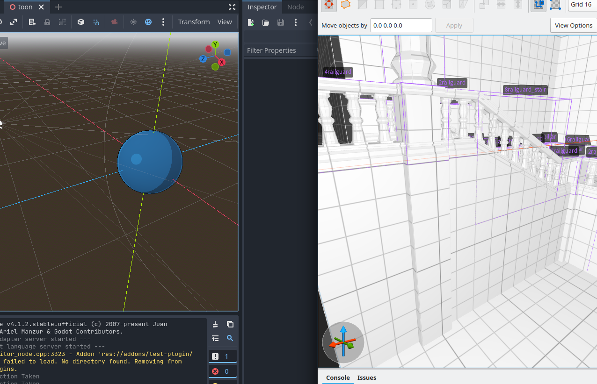

# museum

**Museum** is a Godot Engine project, aimed to present various shader experimentations in a museum environment.

This project is mainly used to discover standard video game shaders and integration with TrenchBroom.

## Resources

### Tools
* [GodotEngine](https://godotengine.org/) 4.1
* [TrenchBroom](https://trenchbroom.github.io/) 2
